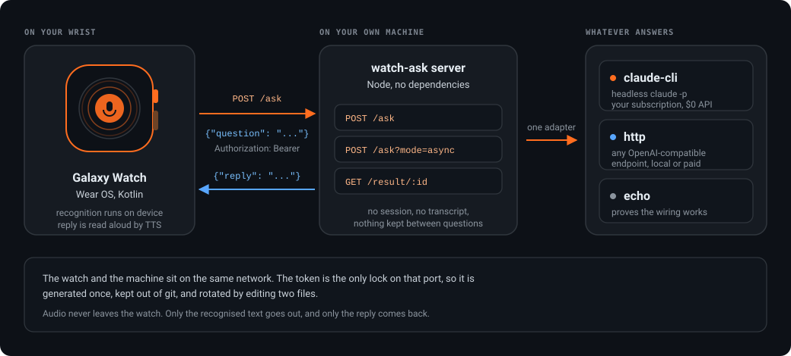

# watch-ask

**Ask a question out loud on your Galaxy Watch. A small server on your own machine answers.**


You are twenty minutes into a walk. Something occurs to you and you want to know
whether the deploy actually went out or what that file does or what you wrote
down last Tuesday. Your phone is in a pocket under a jacket.

So you tap the watch, say the question out loud and drop your arm. The watch
recognises the words on the device and posts the text to a server running on
your laptop at home. Something there answers. Fifteen seconds later the watch
buzzes and reads the answer back to you.

That is the entire project. A voice remote for a language model that runs
somewhere you control.



## What it is and what it is not

**Question in, answer out.** The watch sends one question. The server returns
one reply. Nothing is remembered between questions: no session file, no
transcript on disk, no profile, no notion of who you are. Ask the same thing
twice and it is answered twice from scratch.

That is a deliberate limit rather than an unfinished feature. A thing on your
wrist that keeps a record of everything you said to it is a different project
with a different set of risks. This one stays small enough to read in an
afternoon.

**It is also not an assistant that talks first.** It has no opinion about your
day, tracks nothing and never speaks unless you press the button.

## The interesting part: $0 in API cost

The default backend is `claude-cli`, which runs the Claude Code CLI in headless
mode on your own machine:

```
claude -p --output-format json
```

That is you using your own Claude subscription on your own hardware, the same as
typing in a terminal, so a question from the watch adds nothing to an API bill.

**The honest version of the tradeoff.** The Agent SDK is the obvious way to build
something like this and it is the wrong one here. It authenticates with an API
key billed per token, while a subscription may not be used through it. The
headless CLI is a different thing. It is the same client you already use
interactively, driven by a script instead of a keyboard.

It is not free in the sense of costing nothing. On my own setup a single reply
consumed roughly $0.07 of subscription-limit equivalent and pulled about 27k
tokens of context. The money is zero. The budget it draws from is your weekly
usage allowance.

If you would rather pay per token or run something local, use the `http`
adapter instead. The watch cannot tell the difference.

## Backends

The whole contract for a backend is one function:

```js
ask(question) -> Promise<{ reply }>
```

Three come with the project. Pick one with `ASK_ADAPTER` in `server/.env`.

| Adapter | What answers | Cost |
|---|---|---|
| `claude-cli` | headless `claude -p` on this machine | $0 in API, draws on your subscription limits |
| `http` | any OpenAI-compatible `/chat/completions` endpoint | whatever that endpoint charges |
| `echo` | nothing, it reads your question back | free, the fastest way to prove the wiring works |

`http` covers OpenAI, Ollama, LM Studio, vLLM, llama.cpp, OpenRouter, Groq,
Together and most corporate gateways. Point `ASK_HTTP_BASE_URL` at the root
that has `/chat/completions` under it.

Adding a fourth is a file in `server/src/adapters/` and one line in
`server/src/adapters/index.js`.

## Setup

### 1. The server

```bash
cd server
cp .env.example .env
node -e "console.log(require('crypto').randomBytes(24).toString('hex'))"
```

Put that hex string in `.env` as `ASK_TOKEN`, set `ASK_WORK_DIR` to the project
you want to be able to ask about, then:

```bash
npm start
```

It has no dependencies, so there is nothing to install. Node 18 or newer.

Check it from the same machine before involving the watch at all:

```bash
node src/ask.js "what changed in this repo today?"
```

If that prints an answer, the backend half is finished.

### 2. Let the watch reach it

The watch talks to your machine over the local network, which usually means one
firewall rule and one thing to check.

**Open the port.** On Windows:

```powershell
New-NetFirewallRule -DisplayName "watch-ask 8787" -Direction Inbound `
  -LocalPort 8787 -Protocol TCP -Action Allow -Profile Private
```

On Linux with ufw:

```bash
sudo ufw allow from 192.168.0.0/16 to any port 8787 proto tcp
```

**Same network.** The watch has to be on the same Wi-Fi as the machine. Note
that many watches will silently prefer a Bluetooth link through your phone,
which routes nowhere near your LAN.

**A VPN client will break this.** NordVPN and friends reroute local traffic by
default and the symptom is total silence rather than an error. If nothing works
and nothing explains why, turn the VPN off first and test again.

**Find your machine's LAN address**, which is what the watch needs. Not
`localhost`: on a watch, `localhost` means the watch.

```bash
# Windows
ipconfig | findstr IPv4
# Linux or macOS
ip addr show | grep "inet " || ifconfig | grep "inet "
```

Away from home the LAN address is useless and you need a tunnel
(Cloudflare Tunnel, Tailscale). Read the security section before you do that.

### 3. The watch app

```bash
cd watch
cp local.properties.example local.properties
```

Fill in three lines:

```properties
backend.url=http://192.168.1.42:8787
backend.token=the-same-hex-string-from-server/.env
speech.language=en-US
```

Leave `speech.language` empty to follow the watch's own locale. Then open the
`watch/` folder in Android Studio and run it on the device. From a terminal:

```bash
./gradlew :app:installDebug
```

The app needs the Android SDK, a JDK between 17 and 21, plus developer mode and
ADB debugging turned on in the watch's settings. Pairing a Galaxy Watch to ADB
over Wi-Fi is its own small adventure and is documented well by Google.

The URL and token can also be pushed to an installed app without rebuilding,
which is handy when your laptop's address changes:

```bash
adb shell am start -n com.dimhold.watchask/.MainActivity \
    -e url http://192.168.1.42:8787 -e token abc123 -e lang en-US
```

## Using it

Tap the circle, speak, then tap again when you are done. The button stays live
through pauses, so you can think mid-sentence without being cut off. Words
appear on screen as they are recognised. The answer is shown and read aloud. The
speaker button replays it if a bus went past.

Recognition happens on the watch. Audio never leaves it. Only the recognised
text goes to your server.

## Security, stated plainly

The token is the only lock on that port. Whoever holds it can ask your backend
anything. With `claude-cli` that means asking a program that has access to a
directory on your machine.

So:

- Generate a real random token. Do not reuse one.
- Keep `ASK_TOKEN` in `server/.env` and `backend.token` in
  `watch/local.properties`. Both are gitignored and neither belongs in a commit.
- `ASK_CLAUDE_PERMISSION_MODE` defaults to `default`, which means the CLI
  answers from what it can already read and declines the rest. Setting it to
  `bypassPermissions` gives whoever holds the token a shell on your machine.
  That may be exactly what you want on a laptop behind your own router. It is a
  bad thing to do by accident, which is why it is not the default.
- `ASK_CLAUDE_ALLOWED_TOOLS` is the middle setting, for example
  `Read,Grep,Glob,Bash(git log:*)`.
- Lose the watch and the token goes with it. Rotate it: new value in
  `server/.env`, new value in `watch/local.properties`, restart, reinstall.
- Exposing this to the open internet through a tunnel means one HTTP header
  stands between a stranger and your machine. Put real authentication in front
  of it if you go that way.

## The API

```
POST /ask                {"question": "..."}  -> 200 {"reply": "..."}
POST /ask?mode=async     {"question": "..."}  -> 202 {"jobId": "..."}
GET  /result/<jobId>                          -> 200 {"status": "working|done|failed", ...}
GET  /health                                  -> 200 {"ok": true, "adapter": "..."}
```

Everything except `/health` wants `Authorization: Bearer <token>`.

The synchronous form is the contract. The async form exists because a local
agent regularly thinks for minutes. Anything in front of it will cut a socket
held open that long and throw a finished answer away. The watch uses the
async form for that reason. Scripts should use the plain one.

## Tests

```bash
cd server
npm test
```

43 tests, no test framework, nothing installed. They cover config loading and
its refusals, the HTTP layer including auth and both request modes, plus both
LLM adapters through injected fakes, so the suite runs offline and never spends
a token. The claude-cli tests assert the shape of the command instead of running
it: that the question travels over stdin rather than argv, that no session flag
ever appears, that an API error hiding in stdout is not read as success.

The watch app has no automated tests. Speech recognition, TTS and a physical
button are tested by putting it on a wrist and talking to it.

## Layout

```
server/
  src/config.js              env and .env, with the validation that refuses to start
  src/server.js              routes, auth, the async job table
  src/adapters/              claude-cli, http, echo
  src/ask.js                 CLI client, asks exactly the way the watch does
  test/                      43 tests
watch/
  app/src/main/java/...      MainActivity (speech and HTTP), PulseView (the whole UI), Settings
  local.properties.example   backend URL, token, language
docs/architecture.svg
```

`PulseView` is worth a look if you build for small screens. The entire interface
is one circle that says what is happening by how it moves: breathing when idle,
rings racing outward while listening, a sweeping arc while the backend thinks.
No text, which is what you want on a screen you glance at for half a second
while moving.

## License

MIT. See [LICENSE](LICENSE).
